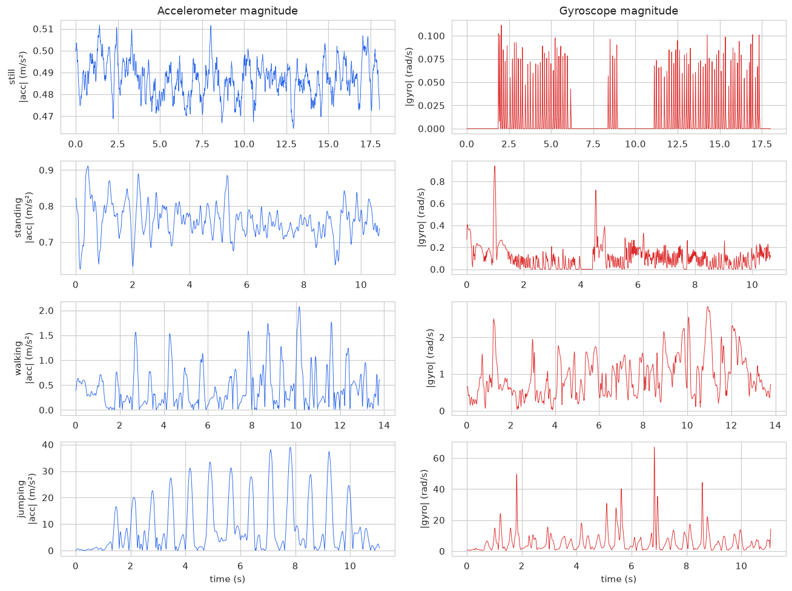
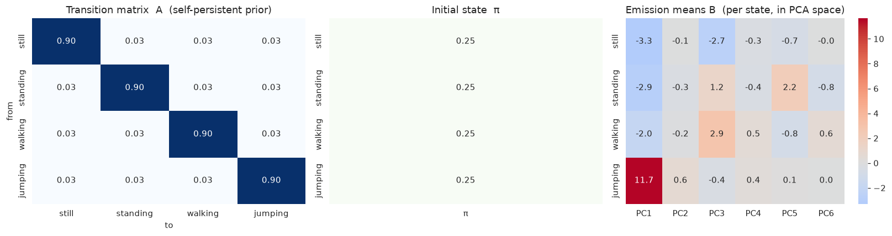
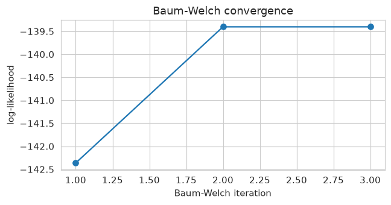
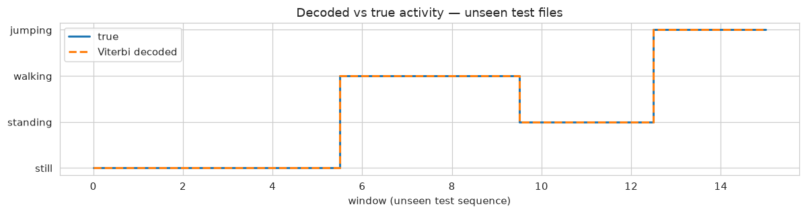
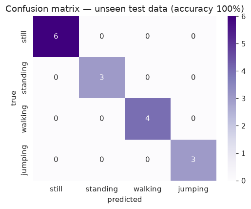

# Modeling Human Activity States Using Hidden Markov Models

**Formative 2 — Hidden Markov Models**

---

## 1. Background and Motivation

Wearable and smartphone inertial sensors are now the backbone of **human activity recognition
(HAR)** systems — fitness trackers count steps, elderly-care devices detect falls, and clinical
tools monitor gait and rehabilitation progress. In every case the quantity we actually care about,
*the activity the person is performing*, is **hidden**: it is never measured directly. What we
observe instead is a noisy stream of accelerometer and gyroscope readings, and the true activity
must be **inferred** from that stream. Because activities also unfold as a *sequence over time*
(a person stays standing for a while, then walks, then stops), the problem is naturally modelled by
a **Hidden Markov Model (HMM)**, whose hidden states are the activities and whose observations are
the sensor-derived features. This project builds such an HMM to recognise four activities —
**still, standing, walking, jumping** — from data we collected ourselves, using the HMM's Viterbi
and Baum–Welch algorithms to decode and learn the latent activity dynamics.

## 2. Data Collection and Preprocessing

**Collection.** Data were recorded with the **Physics Toolbox** app on a single smartphone. Four
activities were each captured as a continuous recording, logging the **accelerometer** (`ax, ay,
az` in m/s²) and **gyroscope** (`wx, wy, wz` in rad/s) with a timestamp column. The measured
**sampling rate is ~98 Hz** on every file (98.6–98.9 Hz accelerometer, 97.5–97.7 Hz gyroscope).

| Activity | Accel duration (s) | Gyro duration (s) | Sampling rate (Hz) |
|---|---|---|---|
| Still (flat) | 35.95 | 18.04 | ~98 |
| Standing | 10.66 | 13.15 | ~98 |
| Walking | 22.90 | 13.80 | ~98 |
| Jumping | 11.09 | 13.31 | ~98 |

The continuous recordings were also segmented into **16 labelled 5-second clips**
(`Datasets/clips/`, 2 accelerometer + 2 gyroscope per activity). Separately, **2 unseen test files**
(`Datasets/unseen_test/`) were built from the **last 40 % of each recording** — data the model never
trains on — each holding several activities with paired accel+gyro and a ground-truth label.

**Sampling-rate harmonization.** All recordings came from one device at ~98 Hz, so rates were
already consistent. Timestamps were nonetheless slightly irregular, so each stream was **resampled
onto a uniform 100 Hz grid by linear interpolation**. This gives the constant sample spacing the
FFT features assume and is the exact mechanism that would harmonize recordings from *different*
phones/rates if more devices were used.

**Windowing.** At 100 Hz we use **2-second windows (200 samples) with 50 % overlap**. Human
locomotion is periodic at ~1–3 Hz, so a 2 s window captures 2–6 full activity cycles — long enough
for stable frequency estimates, short enough to stay approximately stationary. The window length in
samples is derived from the sampling rate (`WIN = WIN_SEC × FS`), so it adapts automatically if the
rate changes. This yields **48 windows** (still 17, walking 12, jumping 10, standing 9).

*Sensor-fusion note.* Accelerometer and gyroscope were logged in separate sessions per activity
(independent clocks), so they cannot be fused sample-by-sample. Since each recording is a single
stationary activity, we window each stream independently and **pair windows by index**, giving one
combined accelerometer+gyroscope feature vector per window.

*Figure 1. Accelerometer (left) and gyroscope (right) magnitude per activity. Still and standing are
low-energy; walking and jumping show large, periodic swings.*

## 3. Feature Extraction

From every window we compute **59 features** spanning both domains, then **Z-score normalize** them
(scaler fit on the training set only). Per axis (ax, ay, az, wx, wy, wz):

- **Time-domain:** mean, standard deviation, variance, RMS, min, max.
- **Frequency-domain (from the FFT):** dominant frequency, spectral energy, spectral entropy.

Plus **cross-axis accelerometer correlations** (axy, axz, ayz) and **Signal Magnitude Area (SMA)**
for accelerometer and gyroscope. These are chosen because they discriminate the activities directly:
energy/RMS/SMA separate high-motion (walking, jumping) from low-motion (still, standing); dominant
frequency distinguishes walking's ~2 Hz gait from jumping's rhythm; and gyroscope variance plus
accelerometer correlations capture the subtle differences between *still* and *standing*. The 59
correlated features are compressed with **PCA (6 components, 91 % of variance)** so the Gaussian
emissions stay well-conditioned given the modest window count.

## 4. HMM Setup and Implementation

| Element | In this project |
|---|---|
| Hidden states **Z** | still, standing, walking, jumping (4 states) |
| Observations **X** | 6-D PCA feature vectors per window |
| Transition **A** | P(activity at *t*+1 \| activity at *t*) |
| Emission **B** | Gaussian density of features given a state (diagonal covariance) |
| Initial **π** | probability the sequence starts in each activity |

**Training — Baum–Welch.** Emissions are given **supervised initial estimates** (per-activity
means/variances from the labelled training windows) and refined with **Baum–Welch (EM)** via
`GaussianHMM.fit`. Training stops when the **change in log-likelihood falls below `tol = 1e-4`** — a
proper convergence check, not a fixed iteration count; it converged in **3 iterations**. The model is
trained on the **head 60 % of each recording only**.

**Why A is a fixed prior, not learned.** The four activities were recorded in *separate*
single-activity sessions, so the data contains **no natural inter-activity transitions** to estimate
`A` from; learning it from an arbitrary concatenation would encode a meaningless order. We therefore
fix `A` to a **principled prior** — self-persistence 0.90 with a small uniform off-diagonal (0.033) —
encoding that activities persist and, when they change, no switch is favoured. Baum–Welch learns the
**discriminative part (the emissions)**, and each hidden state stays aligned with a known activity, so
decoded states are directly interpretable.

**Decoding — Viterbi.** The Viterbi algorithm was **implemented from scratch** in log-space
(numerically stable) and **verified to match `hmmlearn`'s decoder exactly** on the test sequence.

*Figure 2. Transition matrix A (self-persistent prior, left), initial distribution π (middle), and
Baum–Welch-learned emission means per state in PCA space (right). Jumping is set apart by a very large
PC1 (energy) mean.*

*Figure 3. Log-likelihood increases monotonically and converges within three EM iterations.*

## 5. Results and Interpretation

The model was evaluated on **2 unseen test files** (`Datasets/unseen_test/`), built from the last
40 % of the recordings and never seen during training (16 windows total). The from-scratch Viterbi
path matched `hmmlearn` on every file, and every unseen window was classified correctly.

*Figure 4. Viterbi-decoded activity sequence (dashed) overlaid on the true sequence (solid) for the
unseen windows — they coincide.*

*Figure 5. Confusion matrix on unseen data — fully diagonal.*

| State (Activity) | Number of Samples | Sensitivity | Specificity | Overall Accuracy |
|---|---|---|---|---|
| Still | 6 | 1.00 | 1.00 | 1.00 |
| Standing | 3 | 1.00 | 1.00 | 1.00 |
| Walking | 4 | 1.00 | 1.00 | 1.00 |
| Jumping | 3 | 1.00 | 1.00 | 1.00 |
| **Overall** | **16** | — | — | **1.00** |

Per-window emission (MAP) classification — i.e. ignoring transitions entirely — is *also* 100 %, so
the perfect score rests on **feature separability**, not on the transition prior. The four activities
are simply very distinct in inertial features on this single-subject set. The test set is small
(16 windows) and from the same sessions, so this demonstrates strong separability rather than proven
cross-subject generalisation (see Limitations).

## 6. Discussion and Conclusion

**Easiest vs hardest to distinguish.** Walking and jumping are easiest — they carry high, periodic
energy with distinct dominant frequencies, well separated from the two low-motion classes. The
hardest pair is **still vs standing**, since both are low-energy; the small differences captured by
gyroscope variance and accelerometer correlations are what separate them.

**Transition probabilities.** The self-persistent A prior (0.90 diagonal) matches real behaviour:
people remain in an activity for seconds-to-minutes, so self-transitions dominate and switches are
rare. Because the recordings were separate single activities, A is set as this principled prior
rather than learned — an honest reflection of what the data can and cannot support.

**Noise and sampling rate.** Timestamps were slightly irregular; resampling to a uniform 100 Hz grid
stabilised the FFT features. At ~98 Hz the Nyquist limit (49 Hz) sits far above activity frequencies
(1–3 Hz), so undersampling is not a concern.

**Limitations.** (1) Accelerometer and gyroscope came from separate sessions, so features are
index-paired rather than time-synchronised. (2) The 2 unseen test files, while never used in
training, come from the *same* recording sessions (last 40 %); the perfect scores reflect that the
four activities are highly separable, but truly new sessions or participants would test
generalisation more strictly. (3) The dataset is one participant on one device, so `A` is a prior
rather than learned.

**Improvements.** Record synchronised accelerometer+gyroscope, collect multiple sessions and
participants, add a magnetometer, and enrich the spectral features (band-power ratios, multiple FFT
peaks).

**Conclusion.** A Gaussian HMM with supervised initialisation, Baum–Welch training, and Viterbi
decoding recovers the four hidden activity states from inertial features and classifies unseen
windows correctly, demonstrating the HMM as a sound and interpretable model for latent human-activity
recognition.
